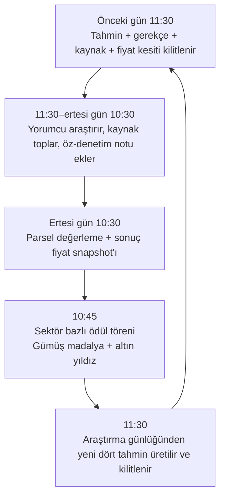

# BitColosİa — Yorumcu Hafızası, Günlük Tur ve Su Barajı Mimarisi

**Durum:** Koddan önce tasarım belgesi  
**Kapsam:** Altı bağımsız sektör yorumcusu; kilitli günlük tahmin; sürekli araştırma ve hata öğrenmesi; 10:30 sonuç; 10:45 ödül; 11:30 yeni tur; doğrulanmış gerçekleşmiş fazlalığın su barajında birikmesi.

> Bu tasarım bir yatırım tavsiyesi, gerçek portföy veya otomatik işlem sistemi değildir. Yorumcu tahminleri yalnızca BitColosİa’daki kurgusal rozet, yıldız ve su barajı kayıtlarını üretir. Gerçek piyasa verisi ölçüm girdisidir; ödül mantığı bu verinin üstünde çalışan oyun katmanıdır.

## 1. Kesinleştirilen oyun ilkeleri

Altı yorumcu birbirinin rakibi değildir. Her yorumcu, yalnızca atandığı sektör içindeki varlıkları izler; yıldız ve madalyası o sektörün sonucuna göre bağımsız biçimde hesaplanır. Bu karar, sektörlerin varlık sayısı eşit olmadığı için adildir: Sektör 1’de bir, Sektör 2’de otuz dört vatandaş/parsel bulunur.[1]

| İlke | Kesin kural |
|---|---|
| Sektör bağımsızlığı | Her sektörün ödülü, yalnızca kendi varlık kümesine göre hesaplanır. Ortak liderlik tablosu yoktur. |
| Kilitli yorum | Yorumcu 11:30’da dört varlık sırasını, gerekçesini, kaynaklarını ve o andaki fiyatları yayınlar. Bu tahmin sonradan değiştirilemez. |
| Sürekli araştırma | Tahmin kilitlendikten sonra yorumcu, bir sonraki 11:30 yorumuna kadar araştırma notları ve öz-denetim kayıtları ekleyebilir; fakat kilitli tahmini değiştiremez. |
| Gerçek sonuç | Tahmin başarısı, 11:30 başlangıç kesiti ile ertesi gün 10:30 sonuç kesiti arasındaki ölçülebilir fiyat farkına göre belirlenir. |
| Ödül ayrımı | Gümüş yuvarlak madalya varlığa; altın yıldız yorumcuya verilir. |
| Parsel ayrımı | Mevcut parsel ekonomisi 10:30→10:30 referans farkı ve ±10 L kuralıyla çalışmaya devam eder. Yorumcu oyunu ayrı, denetlenebilir bir ölçüm penceresine sahiptir.[2] |

## 2. Günlük zaman çizelgesi

Bir tahmin turu bir gün sürer, fakat yorumcunun araştırma penceresi kesintisiz devam eder. Örneğin **T günü 11:30’da** kilitlenen tahmin, **T+1 günü 10:30’da** sonuçlanır. T+1 günü 11:30’da ise araştırma notları kullanılarak yeni tahmin kilitlenir; aynı anda sonraki günün araştırma penceresi başlar.



| Yerel saat | İdempotent iş anahtarı | Sorumluluk | Kalıcı çıktı |
|---:|---|---|---|
| **10:30** | `valuation:YYYY-MM-DD:10:30` | Mevcut parsel değerlemesini çalıştırır; ayrıca yorumcu oyunu için sonuç snapshot’ını dondurur. | `outcome_snapshots` |
| **10:45** | `awards:YYYY-MM-DD:10:45` | Dün 11:30’da kilitlenen altı tahmini karşılaştırır, ödül ve baraj işlemlerini yazar. | `award_results`, `reservoir_transactions` |
| **11:30** | `forecast:YYYY-MM-DD:11:30` | Araştırma günlüğünü özetler, her sektörün yeni dört tahminini üretir ve kilitler. | `forecast_cycles`, `forecasts`, `research_windows` |

Bu üç iş, sabit saat diliminde zamanlanmış HTTP çağrıları olarak uygulanmalıdır; uygulama içi zamanlayıcı kullanılmamalıdır. Her iş, bir `run_key` ile tekrar çalışmalara dayanıklı olmalı; bir ödül veya baraj işlemi aynı gün iki kez yazılamamalıdır.[3]

## 3. Mimari seçenekleri

Mevcut proje TypeScript/Node tabanlıdır. Bu nedenle veri şemasının tek otoritesi mevcut veritabanı ve şema katmanı olmalıdır. Python, tasarım ve araştırma orkestrasyonu için uygundur; ancak aynı verinin hem Python hem de uygulama içinde ayrı ayrı tanımlanması veri tutarsızlığı doğurur.

| Yaklaşım | Nasıl çalışır? | Maliyet ve kurulum | Artısı / sınırı |
|---|---|---|---|
| **Mevcut uygulama içinde günlük işler** | 10:30 ve 10:45 kuralları uygulama sunucusunda çalışır; 11:30’da yapılandırılmış araştırma sonucu sisteme kaydedilir. | En düşük operasyon yükü; mevcut yayın ve zamanlama altyapısıyla uyumludur. | Deterministik kısım çok sağlamdır; kapsamlı web araştırması ayrı araştırma çağrısı ister. |
| **Ayrı Python orkestratörü** | Python servisleri kaynak toplar, hafıza günlüğünü işler ve yapılandırılmış sonucu uygulamanın güvenli uç noktasına gönderir. | Ayrı barındırma, kimlik doğrulama, izleme ve işlem maliyeti gerekir. | Araştırma akışı daha esnektir; iki çalıştırma ortamı yönetilir. |

**Öneri:** İlk sürümde 10:30 sonuç, 10:45 ödül ve baraj hesabı uygulama içinde deterministik kalsın. Python tasarımı, yorumcuların araştırma/günlük katmanı için kullanılan bir servis sınırı olarak saklansın. Böylece yapay zekâ metni sadece **öneri ve gerekçe** üretir; ödül, yıldız ve litre hesabı her zaman kodla tekrarlanabilir biçimde belirlenir.

## 4. Veri modeli

### 4.1 Çekirdek tablolar

| Tablo | Ana alanlar | Amaç |
|---|---|---|
| `sector_commentators` | `id`, `sector_id`, `display_name`, `star_count`, `research_policy_version`, `is_active` | Altı yorumcunun kimliği ve toplam başarı geçmişi. |
| `forecast_cycles` | `id`, `sector_id`, `forecast_date`, `locked_at`, `target_outcome_at`, `status`, `run_key` | Bir sektörün bir günlük tahmin turu. `run_key` benzersizdir. |
| `forecasts` | `cycle_id`, `asset_report_index`, `rank`, `locked_usd_price`, `confidence`, `rationale`, `source_digest_hash` | Dört varlık ve 1–4 tahmin sırası. Bir turda sıralar ve varlıklar benzersizdir. |
| `evidence_items` | `id`, `cycle_id`, `url`, `source_tier`, `captured_at`, `title`, `excerpt`, `content_hash` | Kaynak kanıtı. Kaynaklar “resmî”, “doğrulanmış haber”, “sosyal sinyal” olarak sınıflanır. |
| `research_journal_entries` | `id`, `commentator_id`, `cycle_id`, `entry_type`, `body`, `evidence_ids`, `created_at` | Araştırma, öz-denetim, hata incelemesi ve öğrenme notları. |
| `outcome_snapshots` | `outcome_date`, `captured_at`, `asset_report_index`, `usd_price`, `source`, `is_stale` | 10:30 sonuç kesitinde kullanılan fiyatlar. |
| `award_results` | `cycle_id`, `actual_winner_index`, `winner_delta_l`, `silver_asset_index`, `gold_star_awarded`, `scoring_version` | Sektörün denetlenebilir ödül sonucu. |
| `reservoir_transactions` | `id`, `cycle_id`, `asset_report_index`, `raw_gain_l`, `threshold_l`, `verified_surplus_l`, `formula_version`, `created_at` | Baraja eklenen doğrulanmış su hareketi. |
| `job_runs` | `run_key`, `job_type`, `status`, `started_at`, `completed_at`, `details` | İşletim, tekrar deneme ve hata denetimi. |

### 4.2 Python alan modelleri

Bu sınıflar uygulama öncesi iş kurallarını test etmek için kullanılabilir. Üretim ortamında aynı alanlar, mevcut proje veritabanı şemasıyla tek kaynaktan yönetilmelidir.

```python
from dataclasses import dataclass
from datetime import datetime
from decimal import Decimal
from enum import StrEnum

class SourceTier(StrEnum):
    OFFICIAL = "official"
    VERIFIED_NEWS = "verified_news"
    SOCIAL_SIGNAL = "social_signal"

class JournalType(StrEnum):
    RESEARCH = "research"
    SELF_AUDIT = "self_audit"
    ERROR_REVIEW = "error_review"
    LESSON = "lesson"

@dataclass(frozen=True)
class LockedForecast:
    cycle_id: str
    sector_id: str
    asset_report_index: int
    rank: int                   # 1, 2, 3, 4
    locked_usd_price: Decimal   # 11:30 fiyat kesiti
    locked_at: datetime
    rationale: str
    confidence: Decimal         # 0.00–1.00

@dataclass(frozen=True)
class OutcomePrice:
    asset_report_index: int
    usd_price: Decimal          # ertesi gün 10:30 fiyatı
    captured_at: datetime
    source: str
    is_stale: bool

@dataclass(frozen=True)
class JournalEntry:
    commentator_id: str
    cycle_id: str
    type: JournalType
    body: str
    evidence_ids: tuple[str, ...]
    created_at: datetime
```

### 4.3 Değiştirilemezlik ve denetim kuralları

Tahmin kilidi, yalnızca arayüzde “düzenle” düğmesinin kaldırılması değildir. `forecast_cycles.status = locked` olduktan sonra `forecasts` kayıtları güncellenemez; gerekçe veya kaynakta yazım düzeltmesi gerekiyorsa yeni bir ek günlük kaydı oluşturulur. Böylece geçmiş korunur, yorumcu da yeni bilgiyi saklayabilir.

| Kayıt | Kilitlendikten sonra değişebilir mi? | Doğru yöntem |
|---|---|---|
| Tahmin varlığı ve 1–4 sırası | Hayır | Yeni turu beklemek |
| 11:30 fiyat kesiti | Hayır | Sonuç için aynı kaydı kullanmak |
| Tahmin gerekçesi | Hayır | Ayrı `SELF_AUDIT` veya `RESEARCH` girişi eklemek |
| Kaynak kanıtı | Silinmemeli | Yeni kanıt eklemek; eski kaydın geçerlilik notunu güncellemek |
| Ödül ve baraj işlemi | Hayır | Hata varsa telafi işlemi, silme değil |

## 5. Yorumcunun hafıza ve öğrenme döngüsü

Yapay zekâ, kendi kendine sınırsız biçimde kural değiştiren bir oyuncu olmamalıdır. Sağlıklı yaklaşım; her turda kaynaklardan yapılandırılmış gözlemler çıkarmak, önceki tahminleri ölçmek ve yeni yorum için kısa bir “dersler” özeti üretmektir. Modelden gelen her içerik JSON şemasıyla doğrulanmalı; puan ve ödül hesabı model çıktısına bırakılmamalıdır.[4]

```text
Araştırma gözlemleri
  └─ resmî duyurular / doğrulanmış haberler / sosyal sinyaller
       └─ kaynak kalitesi etiketi + bağlantı + yakalama zamanı
            └─ yorumcunun günlüğüne eklenir
                 └─ 10:30 sonuç ile eski tahmin karşılaştırılır
                      └─ hata incelemesi ve ders kaydı oluşturulur
                           └─ 11:30’da yeni tahmin gerekçesine girdi olur
```

Önerilen öğrenme ölçütleri şunlardır:

| Ölçüt | Hesap | Öğrenme amacı |
|---|---|---|
| Altın yıldız isabeti | `doğru 1. sıra / tamamlanan tur` | En güçlü öngörünün kalibrasyonu |
| Gümüş kapsama oranı | `kazanan listede / tamamlanan tur` | Dört varlıklı araştırma sepetinin kapsamı |
| Ortalama sıra hatası | Seçilen varlıkların gerçek sıra ile tahmin sırası farkı | 1–4 önceliklendirmesinin kalitesi |
| Kaynak kalitesi | Resmî/doğrulanmış/sosyal sinyal ağırlıkları | Düşük güvenli sinyale aşırı dayanmayı önleme |
| Ders tekrarı | Aynı hata etiketinin tekrar sayısı | Öğrenmenin gerçekten gerçekleşip gerçekleşmediği |

**Sosyal medya kuralı:** Sosyal sinyal, araştırma için kullanılabilir; fakat tek başına “doğrulanmış gerçek” olarak kaydedilmez. Her kayıt `source_tier` etiketi taşır. Resmî duyuru ve doğrulanmış haber, yüksek güven katmanı; sosyal medya ise düşük güvenli sinyal katmanıdır.

## 6. 10:30, 10:45 ve 11:30 otomasyon mantığı

### 6.1 10:30 — sonuç kesiti ve parsel değerlemesi

10:30 işi iki görevi atomik biçimde ilişkilendirir: mevcut parsel değerleme sonucunu kaydetmek ve yorumcu tahminleri için ayrı bir sonuç fiyat kesiti oluşturmak. Mevcut parsel kuralı 10:30’daki fiyatı önceki günlük referansla karşılaştırır, litre etkisini ±10 L ile sınırlar ve yeni referans fiyatı saklar.[2]

```python
def run_1030_valuation(local_date: str) -> None:
    run_key = f"valuation:{local_date}:10:30"
    if jobs.already_completed(run_key):
        return

    snapshot = market_data.fetch_snapshot()   # tek toplu sağlayıcı çağrısı
    parcels.apply_daily_reference_difference(snapshot)
    outcomes.freeze_prices(
        outcome_date=local_date,
        captured_at="10:30 Europe/Istanbul",
        snapshot=snapshot,
    )
    jobs.complete(run_key)
```

### 6.2 10:45 — ödül ve baraj işlemi

10:45 işi, hedef 10:30 sonucu oluşmadan çalışmamalıdır. Bu nedenle sabit saate körü körüne güvenmek yerine, ilgili sonuç snapshot’ının ve günlük değerleme işinin `completed` durumunu sorgular. Yoksa açık hata yerine “bekliyor” durumuna geçer ve güvenli biçimde yeniden denenir.

Ödül adaleti için sonuç snapshot’ı `stale = false` olmalıdır. Sağlayıcı yanıtı alınamamış ve uygulama eski önbellekteki fiyatı kullanmışsa, parsel değerlemesi kendi dayanıklılık kuralıyla tamamlanabilse bile yorumcu ödülü **beklemeye alınır**. Yeni, doğrulanmış sonuç fiyatı gelmeden yıldız, madalya veya baraj işlemi yazılmaz.

```python
def run_1045_awards(local_date: str) -> None:
    run_key = f"awards:{local_date}:10:45"
    if jobs.already_completed(run_key):
        return

    outcome = outcomes.require_completed(local_date)
    cycles = forecasts.targeting(local_date)  # önceki gün 11:30’da kilitlenen 6 tur

    for cycle in cycles:
        result = scoring.score_sector(cycle, outcome)
        awards.write_once(result)
        reservoir.post_once(result.reservoir_transactions)
        memory.write_error_review(cycle, result)

    jobs.complete(run_key)
```

### 6.3 11:30 — yeni tahmini kilitle ve yeni araştırma penceresini başlat

11:30 işi, önceki araştırma penceresini kullanarak yeni dört tahmin oluşturur. Tahmin kaydedilirken fiyatlar, gerekçe özeti, güven seviyesi, kaynak bağlantıları ve araştırma politikasının sürümü birlikte saklanır. Sonra bu turun araştırma penceresi açık kabul edilir; yorumcu ertesi gün 11:30’a kadar yeni günlük kayıtlar ekler.

```python
def run_1130_forecast(local_date: str) -> None:
    run_key = f"forecast:{local_date}:11:30"
    if jobs.already_completed(run_key):
        return

    snapshot = market_data.fetch_snapshot()
    for commentator in commentators.active_six():
        research_pack = journal.compile_for_next_comment(commentator.id)
        proposal = research_agent.propose_four_assets(
            sector_id=commentator.sector_id,
            market_snapshot=snapshot,
            research_pack=research_pack,
        )
        validator.require_exactly_four_unique_assets(proposal)
        validator.require_ranks_1_to_4(proposal)
        forecasts.lock(commentator, local_date, snapshot, proposal)
        journal.open_next_research_window(commentator.id, local_date)

    jobs.complete(run_key)
```

## 7. Ödül hesapları

Bir sektör için bütün uygun varlıkların tahmin penceresindeki performansı hesaplanır. “Gerçek kazanan”, **11:30 kesitinden ertesi gün 10:30 kesitine kadar en yüksek pozitif USD/L fiyat farkına** sahip varlıktır. Yüzde değişim yerine fiyat farkı seçilirse su/litre ekonomisinin 1 USD = 1 L birimiyle doğrudan uyum korunur.

```text
delta_i = yuvarla_0,001(sonuc_fiyati_i − kilitli_fiyat_i)
gercek_kazanan = argmax(delta_i)  # yalnızca sektör içindeki uygun varlıklar

gumus_madalya = gercek_kazanan, eğer gercek_kazanan dört tahmin içinde ise
altin_yildiz  = 1, eğer yorumcunun rank=1 tahmini gercek_kazanan ise; aksi halde 0
```

Kazananın negatif sonuçla seçilmesi istenmiyorsa ek bir kural konmalıdır: Sektörde hiçbir varlık pozitif fark üretmemişse “o gün madalya verilmez”. Bu yaklaşım, teknik olarak en az düşen varlığa yanlışlıkla zafer verilmesini engeller. **Önerim:** Bu ek kuralın kullanılmasıdır.

## 8. Doğrulanmış gerçekleşmiş fazlalık ve su barajı formülü

### 8.1 Temel formül

Baraj, tahmin anındaki olasılığı değil; tahmin sonrasında doğrulanmış gerçek sonucu kaydeder. Yalnızca yorumcunun kilitli dört varlık listesinde yer alan ve sonuç penceresinde pozitif ilerleyen varlıklar hesaplamaya girer.

Her seçilmiş varlık için:

```text
P0_i = varlık i’nin 11:30’da kilitlenen USD fiyatı
P1_i = varlık i’nin ertesi gün 10:30 sonuç USD fiyatı

ham_kazanc_i            = max(0, yuvarla_0,001(P1_i − P0_i))
oyun_esigi              = 10 L
dogrulanmis_fazlalik_i  = max(0, ham_kazanc_i − oyun_esigi)

sektor_baraj_kredisi    = toplam(dogrulanmis_fazlalik_i)
gunluk_baraj_kredisi    = altı sektörün toplamı
```

Bu formül, mevcut parselin ±10 L sınırını değiştirmez. Parsel sistemindeki tavan, vatandaş ekonomisini dengede tutar; barajdaki fazlalık ise doğru araştırma sepetinin “tavanı aşan, ancak yalnızca gerçekleşmiş” potansiyelini ayrı bir başarı kaydı olarak gösterir.

| Örnek | 11:30 fiyatı (`P0`) | Ertesi 10:30 (`P1`) | Ham kazanç | Parsel tavanı | Baraja doğrulanmış fazlalık |
|---|---:|---:|---:|---:|---:|
| Seçilmiş A | $40,000 | $45,500 | +5,500 L | +5,500 L | 0 L |
| Seçilmiş B | $40,000 | $56,000 | +16,000 L | +10,000 L | **6,000 L** |
| Seçilmiş C | $4,000 | $2,000 | 0 L | 0 L | 0 L |
| Listede olmayan D | $10,000 | $30,000 | +20,000 L | — | 0 L |

### 8.2 Denge koruması: baraj için ikinci tavan

Bu ham formül, yüksek nominal fiyatlı varlıklarda çok büyük sayılar üretebilir. Baraj parsel değeri olmadığı için farklı bir sayaç olarak büyüyebilir; ancak oyun ekonomisinin okunabilir kalması için ikinci bir güvenlik tavanı önerilir.

| Seçenek | Formül | Etki |
|---|---|---|
| **Ham kayıt** | `baraj += doğrulanmış_fazlalik` | Gerçek fiyat farkını bütünüyle saklar; çok büyük değer üretebilir. |
| **Varlık başı tavan** | `baraj += min(doğrulanmış_fazlalik, 100 L)` | Günlük aşırı hareketlerin barajı tek başına domine etmesini önler. |
| **Sektör başı tavan** | `baraj += min(sektör toplamı, 250 L)` | Altı sektörün katkısını daha dengeli tutar. |

**Öneri:** Hem ham fazlalığı hem de oyun için kullanılan “kredi fazlalığını” saklayın. Arayüzde `Ham doğrulanmış fazlalık` ve `Baraja eklenen su` ayrı gösterilir. İlk oyun sürümünde varlık başına 100 L ve sektör başına 250 L tavanı, su barajının anlamını korurken parsel dengesinden bağımsız, aşırı büyüyen ikinci bir ekonomi oluşmasını engeller.

### 8.3 Neden gümüş madalya ile barajı ayırmak gerekir?

Gümüş madalya, yorumcunun araştırma sepetinin **kapsamını** gösterir: gerçek kazanan dört tahminin içinde miydi? Altın yıldız, yorumcunun **önceliklendirme kalitesini** gösterir: doğru kazananı 1. sıraya koydu mu? Baraj ise yorumcunun seçtiği varlıklar arasındaki **doğrulanmış pozitif taşmayı** biriktirir. Bu üçü aynı şey değildir; birlikte yorumcunun başarısını tek boyuta sıkıştırmadan gösterir.

## 9. Uygulama öncesi kesin kararlar

Kodlamadan önce aşağıdaki kararlar yönetici tarafından onaylanmalıdır:

1. Bir sektörde tüm varlıklar düşerse madalya ve yıldız **verilmesin mi**? Öneri: verilmesin.
2. Baraja yalnızca dört tahmin içindeki tüm pozitif varlıklar mı, yoksa yalnızca gerçek kazanan mı su eklesin? Öneri: dört tahmin içindeki her pozitif varlık eklesin; altın yıldız yine yalnızca doğru 1. sıraya verilsin.
3. Baraj kredi tavanı: varlık başına 100 L ve sektör başına 250 L kabul edilsin mi? Öneri: evet; ham değer de ayrıca saklansın.
4. Araştırmada kullanılacak kaynakların beyaz listesi tanımlansın mı? Öneri: evet; resmî kaynaklar, doğrulanmış haberler ve etiketli sosyal sinyaller ayrı tutulmalıdır.
5. Araştırma ajanının günlük maliyet/bütçesi belirlenmeli mi? Öneri: evet; altı sektör için sabit bir günlük çağrı ve kaynak sınırı olmalıdır.

## Kaynaklar

[1]: ./SECTOR_MAPPING.md "Altı sektör, vatandaş/parsel sayıları ve rapor sıraları"
[2]: ./server/parcels/parcelEconomy.ts "1.000 L taban, referans USD fiyat farkı ve ±10 L sınırı"
[3]: /home/ubuntu/skills/webdev-periodic-updates/SKILL.md "Zamanlanmış işlerin HTTP tabanlı, idempotent ve 6 alanlı cron kuralları"
[4]: /home/ubuntu/skills/builtin-llm-models/SKILL.md "Yapılandırılmış çıktı, model çağrısı ve doğrulama ilkeleri"
